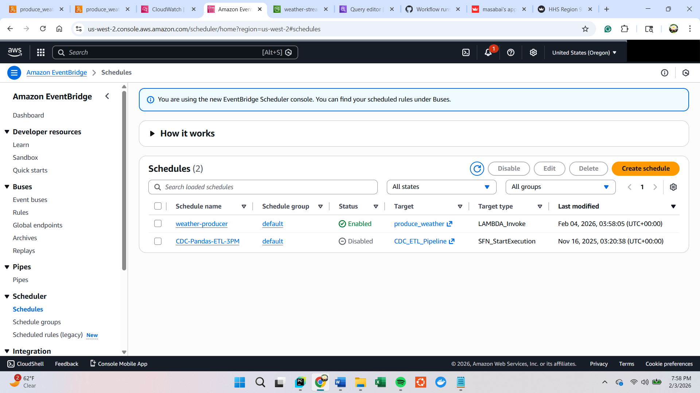
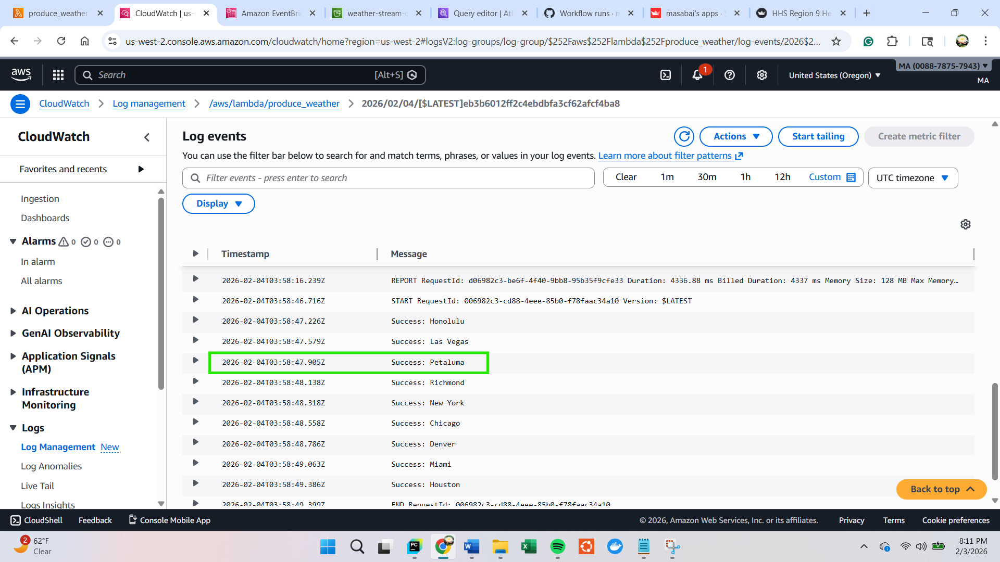
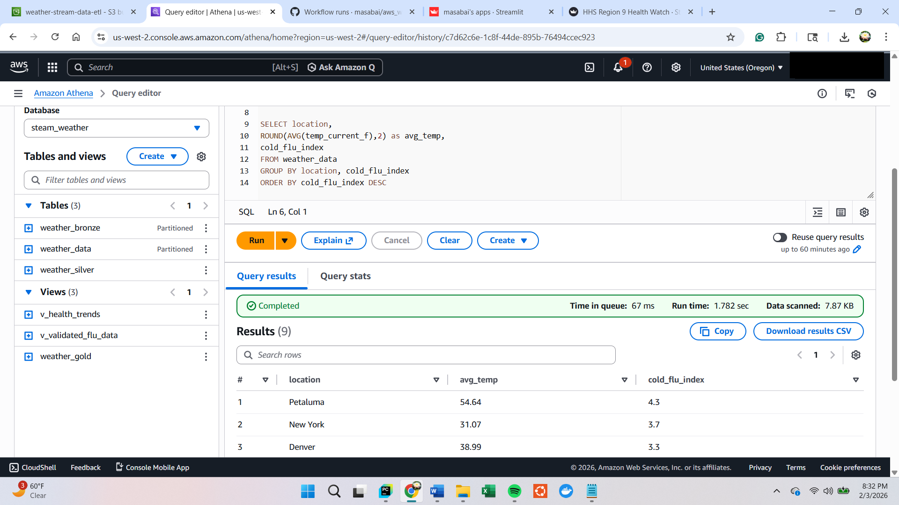
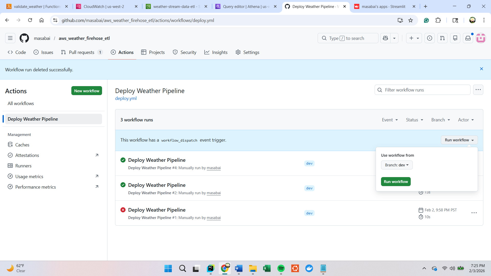
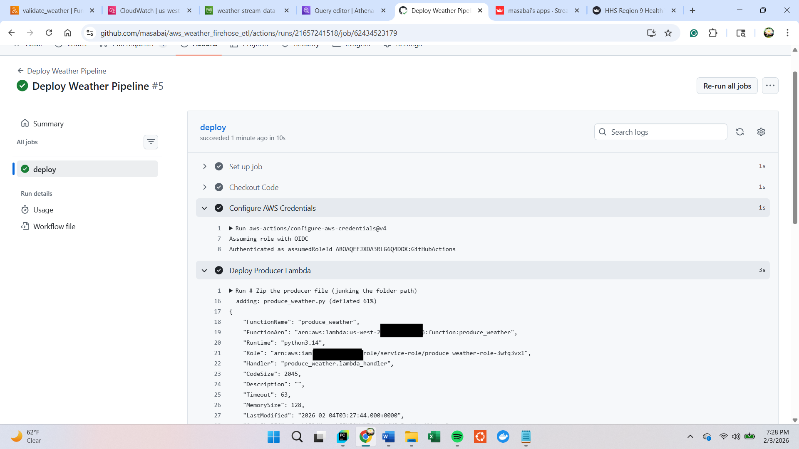

# AWS Serverless Weather Stream
This project demonstrates a fully functional Streaming Data Lake that ingests multi-city weather and AQI
data using a Schema-on-Read architecture. It is designed to monitor regional health risks—specifically Flu 
and Migraine indices—with comprehensive coverage across all major US regions (West, Mountain, South Central,
Midwest, Northeast, and Southeast).

### End-to-End Flow: ###
`EventBridge (Schedule) → Producer Lambda → Kinesis Data Firehose → S3 Raw → Validator Lambda → Silver Zone → Quarantine Zone → Athena → Streamlit → GitHub Actions`

## The Architecture

**Producer** Python (Boto3) local application streaming ndjson to the cloud. The engine fetches data from 
OpenWeather and AccuWeather APIs and pushes to AWS Firehose, which provides serverless transport and buffering for delivery to S3.
This scheduled execution model enables fully automated, time-based ingestion without reliance on always-on services or local cron jobs.

##### *Amazon EventBridge rule triggering the producer Lambda on a fixed schedule for continuous weather data ingestion* #####

##### *CloudWatch logs showing the Producer Lambda successfully streaming weather data to Firehose and S3 in real time.* #####

**Processing**: AWS Lambda (Event-Driven) is triggered by S3 raw/ uploads to validate data and prevent 
recursive loops through strict prefix filtering and application-level execution gating.

**Storage**: Amazon S3 Partitioned Data Lake organized via a Medallion Architecture (Raw, Silver, and Gold 
tiers). To maintain a zero-cost, S3 Lifecycle Policies are implemented to automatically recycle 
athena-results/ and raw/ data after a defined retention period.

**Analytics**: Amazon Athena (SQL-based analytics) provides a "Latest Status" snapshot of regional health
risks, querying directly from S3 using a Schema-on-Read approach.

**Dashboard**: Streamlit application providing real-time Weather & Flu alerts visualization. The dashboard 
retrieves data via an API to avoid hardcoding AWS Access Keys or Secret Keys within the application code. 
The dashboard uses a Manual Refresh button and 60-second caching to prevent Amazon Athena scan costs. 

## CI/CD & Automated Deployment
The project uses GitHub Actions to automate the deployment and validation of the AWS serverless weather pipeline.  
On each push to the main branch, the workflow provisions and deploys cloud resources, validates configuration changes, and ensures the pipeline remains reproducible and consistent across environments.
This approach enables continuous delivery without manual AWS console intervention, reducing deployment risk and configuration drift.

